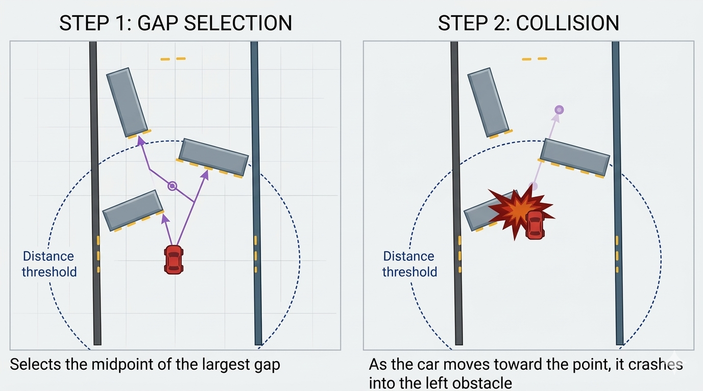

# The Follow-the-Gap Algorithm

The **Follow-the-Gap** (FTG) algorithm is a simple but effective algorithm commonly used in autonomous robot, autonomous racing, and vehicle navigation with the idea of obstacle avoidance in unknown or dynamic environments. The objective of this algorithm is to find a collision-free path by identifying the largest gap in the sensor data from LiDAR, or other range sensors.

In this project, we implement the FTG algorithm as an approach for autonomous racing in [Roboracer Autonomous Racing @CDC-TF 2025 - Qualification Stage](https://autodrive-ecosystem.github.io/competitions/roboracer-sim-racing-cdc-tf-2025/), enabling real-time obstacle avoidance by steering the vehicle toward the largest navigable gap derived from LiDAR data. The core ideas of FTG are as follows:
1. Use LiDAR sensor measures distances to surrounding obstacles (walls) within a 270° field of view (-135° to 135°) relative to the vehicle's heading.
2. Identify all gaps in the sensor data; a gap is a continuous sequences of points with distances greater than a safety threshold (e.g., the vehicle's radius based on its length and width).
3. Find the **largest gap** (the widest collision-free path).
4. Direct the vehicle towards the furthest point in free space and set steering angle towards it.

However, the naive FTG approach (as described above) does not work in autonomous racing. It is because the naive FTG assumes the vehicle can simply steer toward the midpoint of the largest gap; however, this often results in:
* Selecting directions that require sharp or infeasible maneuvers, and as a result, the vehicle may be unable to follow the chosen path, especially at high speeds, leading to instability or collisions.
* It crashes into the obstacles around the midpoint as it doesn't consider the safety around that point.

Therefore, as discussed in [Module B, Lesson 5: Follow the Gap: Obstacle Avoidance](https://roboracer.ai/learn), we need to tweak the original idea:
1. Find the nearest LiDAR point and put a "safety bubble" around it of radius $r_v$ (radius of vehicle).
2. Set all points inside bubble to distance 0. All non-zero points are considered "free space".
3. Find maximum sequence of consecutive non-zeros among the free-space points. This is the maximum gap where the vehicle can drive toward.
4. Find the best point among this maximum gap (naive way is to choose the furthest point in free space and set steering angle towards it).

# Running the Algorithm Code
To run the code, to reproduce the output, or to implement using different algorithm, you can take a look on this [guide](GUIDE.md)
